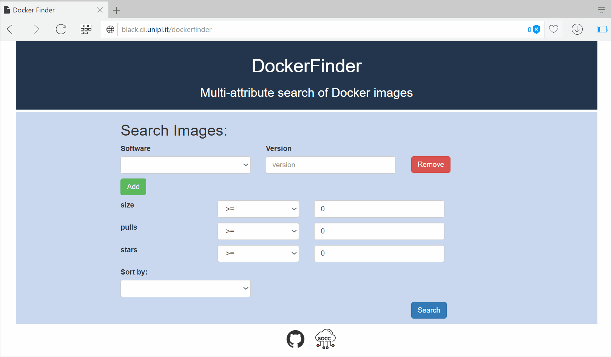

#  DockerFinder: Multi-attribute search of Docker images

[](https://gitter.im/di-unipi-socc/DockerFinder?utm_source=badge&utm_medium=badge&utm_campaign=pr-badge&utm_content=badge)
[](https://raw.githubusercontent.com/di-unipi-socc/DockerFinder/master/LICENSE)

<p align="center">

</p>


[Department of Computer Science, University of Pisa](https://www.di.unipi.it/en/)

Author: Davide Neri.

Contact: davide.neri@di.unipi.it

Try it: [Docker Finder](http://black.di.unipi.it/dockerfinder)

## Why DockerFinder ?

Docker only permits looking for images by specifying a term ,
which is then exploited to return all images where such term occurs
in the name, in the description or in the name of the user
that built the image.

For example, if we submit the query with the term *java*

```
$ docker search java
```
the result is:
```
NAME                   DESCRIPTION                                     STARS     OFFICIAL   AUTOMATED
java                   Java is a concurrent, class-based, and obj...   1264      [OK]       
anapsix/alpine-java    Oracle Java 8 (and 7) with GLIBC 2.23 over...   177                  [OK]
develar/java                                                           52                   [OK]
isuper/java-oracle     This repository contains all java releases...   48                   [OK]

```

As a consequence, users cannot specify more complex queries, e.g., by imposing requirements on the
software distributions an image must support

## What is DockerFinder ?

```
DockerFinder is a microservice-based prototype that permits searching for images
based on multiple attributes.
```

The attributes for which is possible to search an image are:
  1. **Software versions** supported (e.g. python 2.7 or java 1.8).
  2. **Size**.
  3. **Stars**.
  4. **Pulls**.


## GUI of Docker Finder

The GUI of DockerFinder is running on [**http://black.di.unipi.it/dockerfinder**](http://black.di.unipi.it/dockerfinder)

An example of a multi-attribute query submitted to DockerFinder is shown in the gif below.  It search the images that support:
- *Java 1.8*,
- *Python 2.7*,
- *pulls >= 20*.

<div  align="center">

</div>


## Docker Finder main steps

1. DockerFinder crawls images from a remote Docker registry,
2. It automatically analyses such images to produce multi-attribute descriptions to be stored in a local repository,
3. It permits searching for images by querying the local repository through a GUI or a RESTful API.


<div align="center">

</div>


## The microservice-based architecture DockerFinder

The figure below details the microservice-based architecture of Docker Finder. The microservice (represented as rectangles) are divided in the three three main functionalities carried out by Docker Finder:
  1. **[Analysis](https://github.com/di-unipi-socc/DockerFinder/tree/master/analysis)**: the analysis of each image consists in retrieving all the metadata already available in the registry, and in running a container to au-
tomatically extract its runtime features (e.g., the software distributions it support).
  2. **[Storage](https://github.com/di-unipi-socc/DockerFinder/tree/master/storage)**:  DockerFinder stores all produced image
descriptions in a local repository.
  3. **[Discovery](https://github.com/di-unipi-socc/DockerFinder/tree/master/discovery)**: DokcerFinder allows users to search for
images by  submit multi-attribute queries thorugh a GUI or RESTful APIs (*Search API*, *Software service API*).

<div align="center">

</div>

# Getting started
Docker Finder can be deployed as a multi-container Docker application. The microservice-based architecture of Docker Finder is
deployed as a multi-container Docker application (figure).

In order to deploy Docker Finder (locally) the requirements are the following:

 - [**Docker engine >= 1.12**](https://docs.docker.com/engine/installation/)
 - [**Docker Compose >= 1.9.0 **](https://docs.docker.com/compose/install/)

Each service is shippend within a Docker image (represented as boxes) and the protocol communications are represented as dashed lines (e.g. HTTP, AMQP, mongodb).

<div align="center">

</div>

### Docker Compose - Single-host deployment
Docker Finder can be runned locally as a multi-container Docker application using *Docker Compose*.

In order to run **DockerFinder** into your local host, copy, paste, and tun  the following command.

```
$ git clone https://github.com/di-unipi-socc/DockerFinder.git && cd DockerFinder &&
docker-compose up -d

```

It starts all the services of **DockerFinder** into your local host *127.0.0.1*.

Every service can be reached:
- [GUI  (port 80)](http://127.0.0.0.1/dockerfinder)
- [Images API (port 3000)](http://127.0.0.1:3000/api/images)
- [Software API (port 3001)](http://127.0.0.1:3001/api/software)
- [RabbitMQ managment (port 8082)](http://127.0.0.1:8082)


In order to stop all the containers:

```
$ docker-compose stop
```

### Docker Swarm - Multiple-host deployment

The requirements for deploying DockeFinder as a swarm are:
- `docker >= 1.13`
- `docker-compose >= 1.10`
- `docker-machine >= 0.9`
- `Virtualbox > 5`

DockerFinder is deployed in 3 VMs using *virtualBox*, where :
- *swarm-manger* is the Vm where the core services of Docker Finder are executed : *crawler*, *rabbitmq*,*images_server*, *images_db*, *software_server*, *software_db*,   *webapp*.
- *worker-1*: is the VM where the *scanner* s are executed.
- *worker-2*: is the VM here the *scanner* s are executed.

The script `init-all.sh`:
- creates 3 virtualbox VMs with the `docker-machine` tool and initialize a swarm with the `docker swarm` command, composed by three nodes:
      - `swarm-manager`: is the manager of the swarm
      - `worker-1`: is the first worker
      - `worker-2`: is the second worker.

#### How to run


```
./init-all.sh
```
Enter in the `swarm-manager` machine:
```
eval $(docker-machine env swarm-manager)
```
Deploy the services:
 ```
 docker stack deploy --compose-file=docker-compose.yml df
 ```

Monitor the services:
```
docker stack ps df
```

Stop the services:
```
docker stack rm df
```

<!-- - initialize an overlay network (if it does not exist).
- *Build* and *push* the images into [Docker Hub- diunipisocc](https://hub.docker.com/r/diunipisocc/docker-finder/tags/) (must be looged-in).

The `start_all.sh` script:
- *create* the services by downloading the images from [Docker Hub-diunipisocc](https://hub.docker.com/r/diunipisocc/docker-finder/tags/)
- *run* the services:
    - **Crawler**, **RabbiMQ**, **images_server**, **images_db**,**software_server**,**software_db**  ,**monitor**: run in the same host with a constraint  label.
    - **scanner** can run in a any host that are partecipating in the swarm. -->
