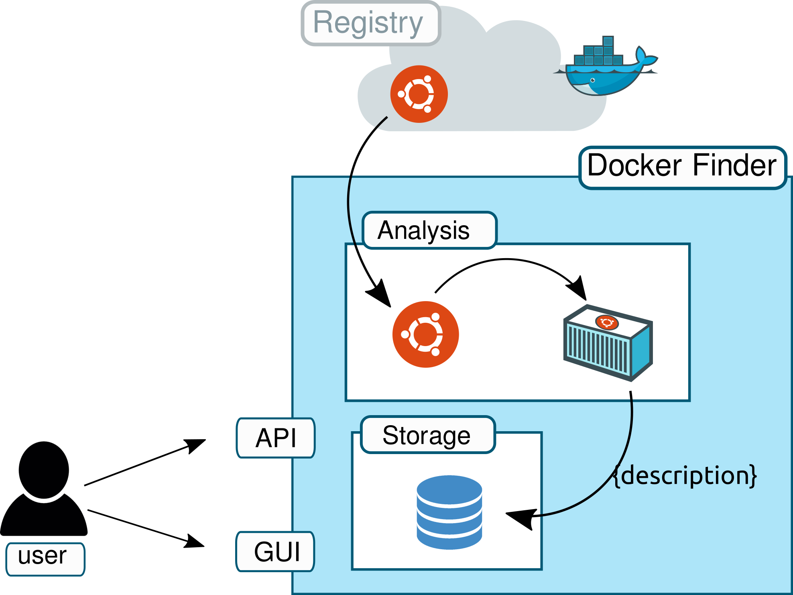
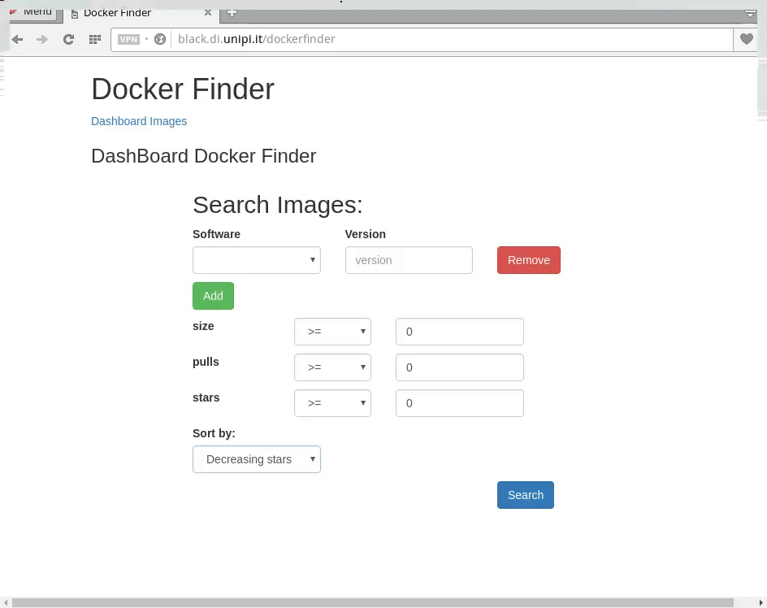
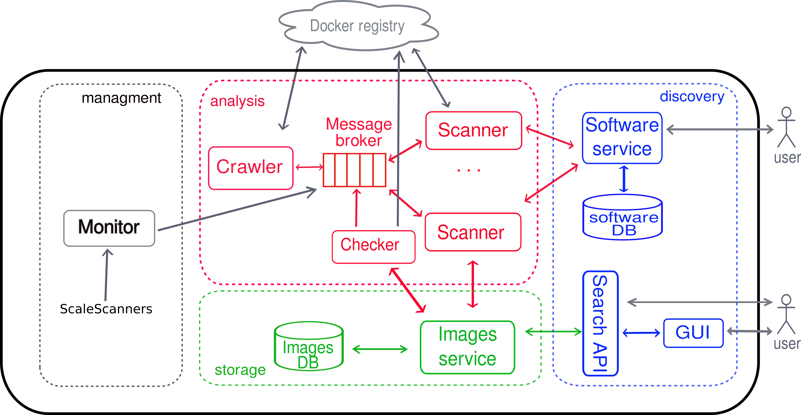
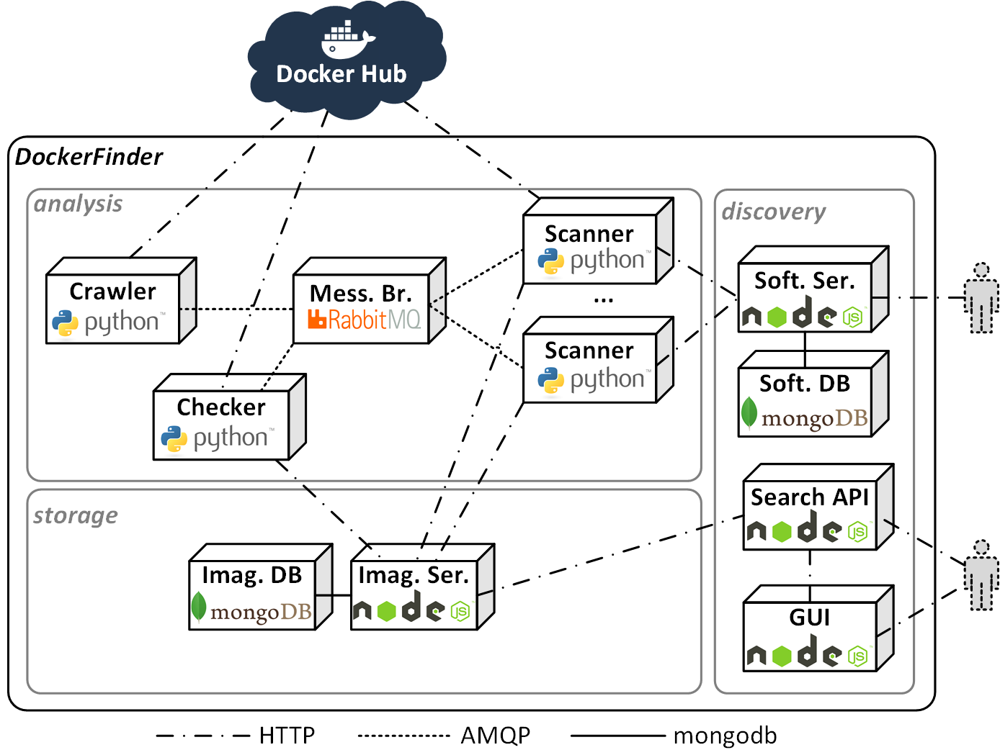

#  DockerFinder: Multi-attribute search of Docker images

University of Pisa.

## What is Docker Finder ?

The current support for searching Docker images is limited, as Docker registries only permit looking for images “by name”, i.e. by specifying a term, which is then exploited to return all images where such term occurs
in the name, in the description or in the name of the user
that built the image. As a consequence, users cannot specify
more complex queries
.

DockerFinder is a **microservice-based** prototype that permits searching for images based on multiple attributes, e.g., *software distributions* they support, *image name*, *image size*, or *image pull*.


## Docker Finder main steps

1. DockerFinder crawls images from a remote Docker registry,
2. It automatically analyses such images to produce multi-attribute descriptions to be stored in a local repository,
3. It permits searching for images by querying the local repository through a GUI or a RESTful API.


<div align="center">

</div>


## GUI of Docker Finder

The GUI of DockerFinder is running on [**http://black.di.unipi.it/dockerfinder**](http://black.di.unipi.it/dockerfinder)

An example of a multi-attribute query submitted to DockerFinder is shown in the gif below.  It search the images that support:
- *Java 1.8*,
- *Python 2.7*,
- *pulls >= 20*.

<div  align="center">

</div>


## The microservice-based architecture DockerFinder

The figure below details the microservice-based architecture of Docker Finder. The microservice (represented as rectangles) are divided in the three three main functionalities carried out by Docker Finder:
  1. **[Analysis](https://github.com/di-unipi-socc/DockerFinder/tree/master/analysis)**: the analysis of each image consists in retrieving all the metadata already available in the registry, and in running a container to au-
tomatically extract its runtime features (e.g., the software distributions it support).
  2. **[Storage](https://github.com/di-unipi-socc/DockerFinder/tree/master/storage)**:  DockerFinder stores all produced image
descriptions in a local repository.
  3. **[Discovery](https://github.com/di-unipi-socc/DockerFinder/tree/master/discovery)**: DokcerFinder allows users to search for
images by  submit multi-attribute queries thorugh a GUI or RESTful APIs (*Search API*, *Software service API*).

<div align="center">

</div>

## DockerFinder deployments
The microservice-based architecture of Docker Finder is
deployed as a multi-container Docker application (figure)  Each service is shippend within a Docker image (represented as boxes) and the protocol communications are represented as dashed lines (e.g. HTTP, AMQP, mongodb).

<div align="center">

</div>

### Docker Compose - Single-host deployment

The guide assumes you have the  [Docker Engine](https://docs.docker.com/engine/installation/) and  [*Docker Compose*](https://docs.docker.com/compose/install/) installed in your local machine


In order to run **DockerFinder** into your local host, copy, paste, and tun  the following command.

```
$ git clone https://github.com/di-unipi-socc/DockerFinder.git && cd DockerFinder &&
docker-compose up -d

```

It starts all the services of **DockerFinder** into your local host *127.0.0.1*.

- [GUI  (port 80)](http://127.0.0.0.1/dockerfinder)
- [Images API (port 3000)](http://127.0.0.1:3000/api/images)
- [Software API (port 3001)](http://127.0.0.1:3001/api/software)
- [RabbitMQ managment (port 8082)](http://127.0.0.1:8082)


In order to stop all the containers:

```
$ docker-compose stop
```

### Docker Swarm - Multiple-host deployment


The initializarion script `init-all.sh` does:

- initialize an overlay network (if it does not exist).
- *Build* and *push* the images into [Docker Hub- diunipisocc](https://hub.docker.com/r/diunipisocc/docker-finder/tags/) (must be looged-in).

The `start_all.sh` script:
- *create* the services by downloading the images from [Docker Hub-diunipisocc](https://hub.docker.com/r/diunipisocc/docker-finder/tags/)
- *run* the services:
    - **Crawler**, **RabbiMQ**, **images_server**, **images_db**,**software_server**,**software_db**  ,**monitor**: run in the same host with a constraint  label.
    - **scanner** can run in a any host that are partecipating in the swarm.
